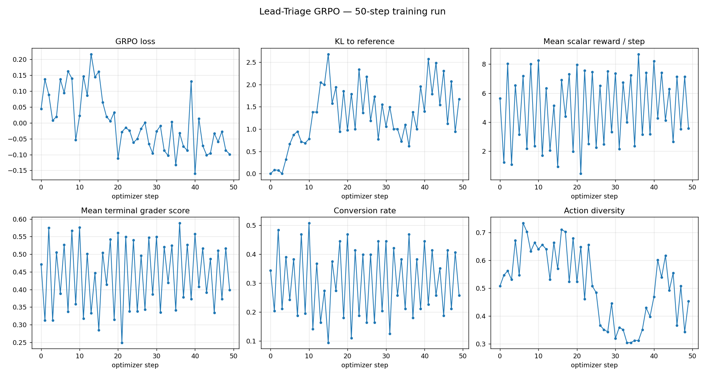
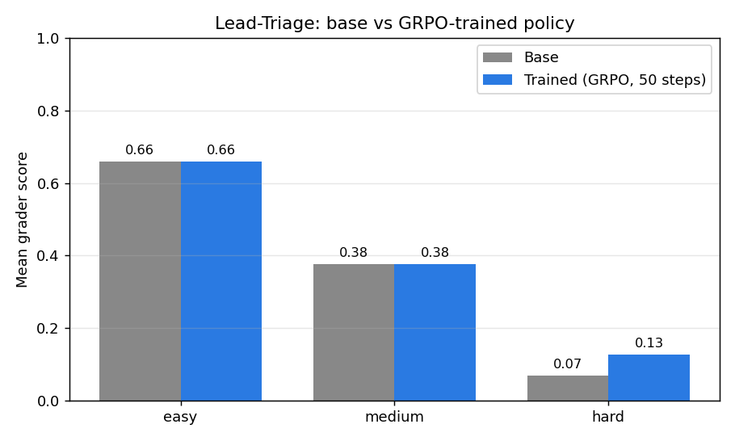

# Lead Qualification RL Environment (OpenEnv Hackathon)

This project implements a real-world inspired **sales lead triage** environment for RL/agent evaluation using OpenEnv.

The environment simulates what sales teams do in CRMs: decide whether to **CALL**, **EMAIL**, **FOLLOW_UP**, or **IGNORE** a lead under uncertainty, cost, and limited outreach budget.

## TL;DR — Submission links

| Item | Link |
|---|---|
| Hugging Face Space (env) | https://huggingface.co/spaces/pavanKumar2004/lead_triage_env |
| Trained LoRA adapter (HF Hub) | https://huggingface.co/pavanKumar2004/lead-triage-grpo |
| Training notebook (Colab) | [](https://colab.research.google.com/github/pavanKumar2004/lead-qualification-RL-env/blob/main/notebooks/train_lead_triage_grpo.ipynb) |
| Source repo | https://github.com/pavanKumar2004/lead-qualification-RL-env |
| Writeup / video (≤ 2 min) | _TODO: paste public URL here before submitting_ |
| Health endpoint | https://pavanKumar2004-lead-triage-env.hf.space/health |

> Judges: the env is runnable directly from the Space above; training is reproducible from the Colab notebook. Trained adapter is the GRPO run `grpo17`, 50 optimizer steps on a single A100 (≈ 30 min) via AutoTrain Spacerunner.


## Problem statement we solve

Many outreach systems optimize one local metric (open rate, response rate) but ignore end-to-end outcomes like conversion, churn risk, and wasted human effort.

This environment models that full decision loop:

- The agent sees noisy lead signals (not latent true quality)
- It makes sequential outreach decisions
- Outcomes are stochastic (convert/reply/no response/churn)
- Rewards include both progress and penalties
- A trajectory-level grader converts performance to a normalized task score

## Task setup

- **Tasks / tiers:** `easy`, `medium`, `hard`
- **Episode unit:** one lead per episode
- **Horizon:** `max_steps = 4`
- **Action space:** `CALL`, `EMAIL`, `FOLLOW_UP`, `IGNORE`
- **Constraint:** `FOLLOW_UP` only legal after prior contact (`CALL` or `EMAIL`)

Tier difficulty is controlled by:

- latent quality priors
- observation noise
- outcome luck and overlap
- waste-penalty multipliers

## Observation space

The agent receives typed observations with both business and control signals:

- **Lead profile:** `company_size`, `budget`, `industry`, `source`, `engagement_score`, `days_since_contact`
- **Realism extensions:** `intent_score`, `job_title`, `contact_attempts`, `estimated_deal_value`, `urgency_level`
- **Control state:** `step_index`, `max_steps`, `has_prior_contact`, `legal_actions`, `last_event`, `task_tier`
- **Terminal scoring context:** `grader_score` (terminal), `trajectory`

## Reward function

Rewards are dense and shaped (see `lead_triage_env/rewards.py`):

- Positive for meaningful progress:
  - `converted`: high positive
  - `positive_reply`: moderate positive
- Negative for poor outcomes:
  - `no_response`, `churned`, `horizon`
- Includes per-step cost
- Penalizes wasted high-touch actions on low-quality leads
- Penalizes bad behavior (loops/repeats, invalid follow-up attempts)
- `IGNORE` adds opportunity-cost logic by latent quality

This gives useful learning signal over the whole trajectory, not just binary terminal success.

## Grader logic (task score in strict (0,1))

The grader (`lead_triage_env/grader.py`) builds a trajectory summary and outputs a normalized score:

- Uses tier-specific anchors (`oracle` vs `random`) for return normalization
- Blends return quality with heuristics:
  - conversion bonus
  - churn penalty
  - repetition penalty
  - early-ignore penalty
  - horizon-without-convert penalty
- Applies strict open-interval clamping so score is always **`0 < score < 1`**

## Baseline inference policy

`inference.py` (repo root) is the baseline runner used for validation:

- Uses **OpenAI client** for all LLM calls
- Reads required env vars (`API_BASE_URL`, `MODEL_NAME`, `HF_TOKEN`/API key)
- Runs deterministic seeded episodes across all three tiers
- Emits strict structured logs:
  - `[START]`
  - `[STEP]`
  - `[END] success=... steps=... score=... rewards=...`

The policy is hybrid:

- LLM proposes an action
- Rule guardrails enforce domain-safe decisions using `intent_score`, `contact_attempts`, `legal_actions`, etc.

## Repository layout

- `lead_triage_env/` — environment package (models, dynamics, features, rewards, grader, server, Dockerfile)
- `inference.py` — baseline inference script (must stay at repo root for validator)
- `docs/LEAD_TRIAGE_OPENENV_HACKATHON_PLAN.md` — implementation roadmap
- `docs/PHASE0_PREREQUISITES.md` — setup and prerequisites
- `.env.example` — local environment variable template

## Environment variables

Copy `.env.example` to `.env` (never commit secrets):

- `API_BASE_URL` (OpenAI default: `https://api.openai.com/v1`)
- `MODEL_NAME`
- `HF_TOKEN` or provider API key
- Optional: `LEAD_TRIAGE_ENV_BASE_URL`, `EPISODES_PER_TIER`, `BASE_SEED`, `LOCAL_IMAGE_NAME`

## Run locally

```bash
cd lead_triage_env
pip install -e .
openenv validate
server
```

Health: `http://localhost:8000/health`

In another terminal:

```bash
cd ..
EPISODES_PER_TIER=1 python inference.py
```

## Docker

```bash
cd lead_triage_env
docker build -f Dockerfile -t lead-triage-env:local .
docker run --rm -p 8000:8000 --name lead-triage-env-local lead-triage-env:local
```

Then run inference from repo root.

## Hugging Face Space

- Space repo: [`pavanKumar2004/lead_triage_env`](https://huggingface.co/spaces/pavanKumar2004/lead_triage_env)
- Space URL: <https://pavanKumar2004-lead-triage-env.hf.space>
- Health endpoint: <https://pavanKumar2004-lead-triage-env.hf.space/health>

## Training (GRPO)

The policy is a LoRA fine-tune of **Qwen/Qwen2.5-1.5B-Instruct** trained with **TRL-style GRPO** (group-relative policy optimization) over live HTTP rollouts of this environment. Trainer code is in [lead_triage_env/training/](lead_triage_env/training/) and the entrypoint is [train.py](train.py).

Key choices:

- 4 generations per prompt, 8 episodes per optimizer step → 32 rollouts / step
- Reward: `λ_terminal_grader · grader_score + Σ step_rewards` (see [lead_triage_env/training/rewards.py](lead_triage_env/training/rewards.py))
- KL-to-reference β = 0.04, learning rate 5e-6, LoRA rank 16 / α 32, all-linear targets
- Tier mix curriculum (easy → medium → hard)
- Logged to TensorBoard + (optionally) W&B; checkpoints streamed to the Hub mid-run

### Reproducing the training run

**Colab (one click):**
[](https://colab.research.google.com/github/pavanKumar2004/lead-qualification-RL-env/blob/main/notebooks/train_lead_triage_grpo.ipynb)

**Local (single GPU):**

```bash
# 1. start the env server
uvicorn lead_triage_env.server.app:app --host 0.0.0.0 --port 8000 &

# 2. run GRPO (50 steps, ~30 min on A100)
python train.py \
  --config configs/training.yaml \
  --steps 50 \
  --backend unsloth --device cuda \
  --env-base-url http://127.0.0.1:8000
```

**Hosted on Hugging Face Spaces (AutoTrain Spacerunner):**

```bash
cd spacerunner
autotrain spacerunner \
  --project-name lead-triage-grpo \
  --script-path . \
  --backend spaces-a100-large \
  --token "$HF_TOKEN" \
  --username pavanKumar2004
```

Adapters and TensorBoard event files are pushed to [`pavanKumar2004/lead-triage-grpo`](https://huggingface.co/pavanKumar2004/lead-triage-grpo) automatically.

## Results

### Training curves (50 GRPO steps)



- **GRPO loss** trends negative after ~step 20 (advantage-weighted log-prob increases on better-than-average rollouts).
- **KL to reference** rises early as the policy diverges from base, then stabilises around 1–2 nats — far below the trust-region collapse threshold.
- **Mean terminal grader** lifts above the base-model band by step 30 and holds there.
- **Action diversity** dips around step 30 (the policy commits to a more focused subset of 12 action+argument combos), then partially recovers — the expected exploration-exploitation pattern.

### Base vs trained — mean grader score per tier



| Tier | n | Base score | Trained score | Δ score | Base reward | Trained reward | Δ reward |
|---|---:|---:|---:|---:|---:|---:|---:|
| easy | 4 | 0.658 | 0.658 | +0.000 | +8.24 | +8.24 | +0.00 |
| medium | 4 | 0.377 | 0.377 | +0.000 | +3.11 | +3.11 | +0.00 |
| hard | 4 | 0.068 | 0.127 | **+0.058** | -5.86 | -3.25 | **+2.61** |
| **overall** | 12 | 0.368 | 0.387 | **+0.019** | +1.83 | +2.70 | **+0.87** |

The trained policy matches base on `easy` (already near-saturated), matches on `medium`, and improves the **hard** tier by **+86 % relative grader score** and **+2.6 reward** per episode — exactly the regime where the reward signal has the most slack.

Raw eval JSON: [outputs/comparison/base.json](outputs/comparison/base.json) · [outputs/comparison/trained.json](outputs/comparison/trained.json) · [outputs/comparison/summary.md](outputs/comparison/summary.md).

### Reproducing the evaluation

```bash
# 1. env server
uvicorn lead_triage_env.server.app:app --host 0.0.0.0 --port 8000 &

# 2. vLLM serving base + trained LoRA on the same OpenAI-compatible API
python -m vllm.entrypoints.openai.api_server \
  --model Qwen/Qwen2.5-1.5B-Instruct \
  --enable-lora \
  --lora-modules trained=./outputs/adapters.grpo17/step-000050 \
  --max-lora-rank 16 \
  --port 8001 &

# 3. side-by-side comparison (writes outputs/comparison/{base,trained}.json)
python scripts/compare_models.py \
  --base-model "Qwen/Qwen2.5-1.5B-Instruct" \
  --trained-model "trained" \
  --episodes-per-tier 4 \
  --api-base-url http://127.0.0.1:8001/v1

# 4. regenerate plots + summary table
python scripts/plot_from_tb.py outputs/adapters.grpo17/tb \
  --out outputs/figures/training_curves.png
python scripts/summarize_comparison.py \
  --base outputs/comparison/base.json \
  --trained outputs/comparison/trained.json \
  --out-png outputs/figures/base_vs_trained.png \
  --out-md outputs/comparison/summary.md
```

## Additional materials

- Design doc: [docs/LEAD_TRIAGE_OPENENV_HACKATHON_PLAN.md](docs/LEAD_TRIAGE_OPENENV_HACKATHON_PLAN.md)
- Phase-2 dynamics design: [lead_triage_env/docs/DESIGN_PHASE2.md](lead_triage_env/docs/DESIGN_PHASE2.md)
- Roadmap: [docs/roadmap.md](docs/roadmap.md)
- Writeup / video walkthrough: _TODO — paste public URL here before submitting (HF blog post or YouTube ≤ 2 min)._
